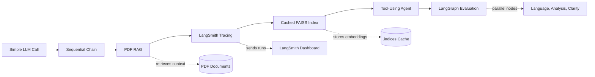
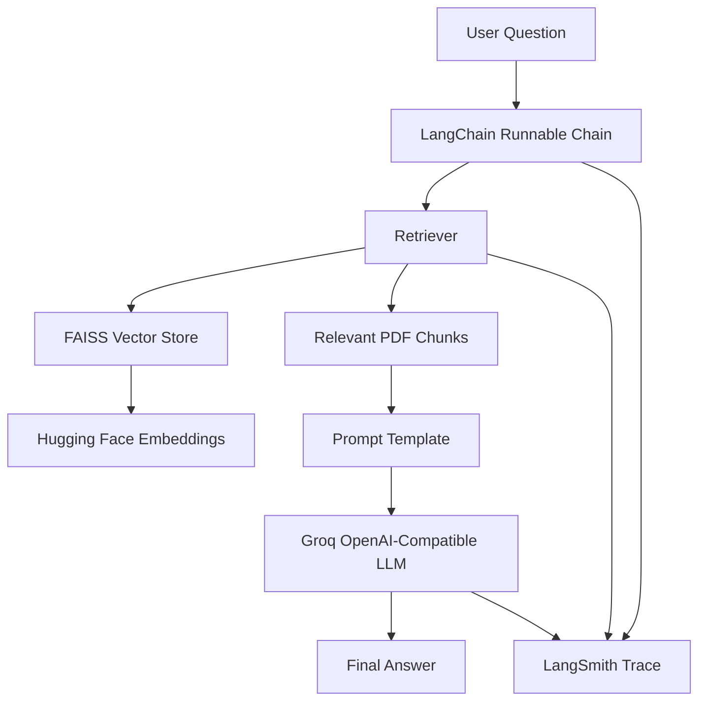
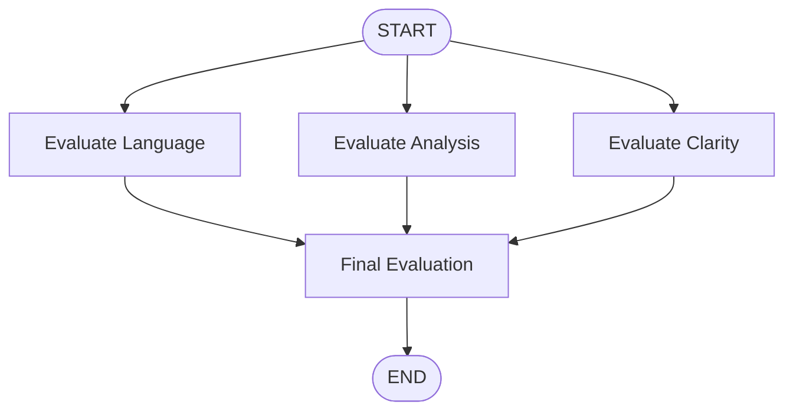

# LangSmith AI Workflow Demos

<p align="center">
  <strong>Build, trace, retrieve, evaluate, and orchestrate LLM workflows with LangChain, LangSmith, RAG, Agents, and LangGraph.</strong>
</p>

<p align="center">
  
  
  
  
  
</p>

This project is a practical, step-by-step learning workspace for building production-style LLM application patterns. It starts with a simple LangChain call, then gradually introduces sequential chains, PDF-based RAG, LangSmith observability, cached vector indexes, tool-using agents, and graph-based evaluation workflows.

## Demo Preview

The video below shows LangSmith monitoring/tracing for the project workflow.

<p align="center">
  <video src="assets/langsmith-monitoring-demo.mp4" width="900" controls>
    Your browser does not support embedded videos.
  </video>
</p>

If your Markdown viewer does not render embedded videos, open it directly:

[Watch the LangSmith monitoring demo](assets/langsmith-monitoring-demo.mp4)

## Project Flow



## What You Will Learn

| Area | What this project demonstrates |
| --- | --- |
| LangChain basics | Prompt templates, LLM calls, output parsers, and chain composition |
| Sequential chains | Passing one model output into another prompt |
| RAG | Loading PDFs, chunking documents, embedding text, retrieving context, and answering from source material |
| LangSmith | Tracing setup steps, parent/child runs, metadata, tags, and model calls |
| FAISS caching | Saving and reusing local vector indexes to avoid rebuilding embeddings every run |
| Agents | Connecting an LLM to external tools such as search and weather APIs |
| LangGraph | Running parallel evaluation nodes and aggregating final feedback |

## Repository Structure

```text
LANGSMITH/
|-- 1_simple_llm_call.py              # Basic prompt -> LLM -> parser chain
|-- 2_sequential_chain.py             # Report generation -> summary generation
|-- 3_rag_v1.py                       # Basic PDF RAG pipeline
|-- 3_rag_v2.py                       # RAG with traced setup functions
|-- 3_rag_v3.py                       # Full parent/child RAG tracing
|-- 3_rag_v4.py                       # RAG with cached FAISS indexes
|-- 4_agent.py                        # Agent with search and weather tools
|-- 5_langgraph.py                    # LangGraph essay evaluation workflow
|-- assets/
|   `-- langsmith-monitoring-demo.mp4 # LangSmith monitoring demo video
|-- .indices/                         # Generated FAISS index cache
`-- README1.md                        # Project documentation
```

## Architecture Snapshot



## Tech Stack

- Python
- LangChain
- LangSmith
- LangGraph
- Groq OpenAI-compatible API
- FAISS
- Hugging Face sentence-transformer embeddings
- DuckDuckGo search
- Weatherstack API example

## Setup

Create and activate a virtual environment:

```bash
python -m venv .venv
.venv\Scripts\activate
```

Install dependencies:

```bash
pip install python-dotenv langchain langchain-core langchain-community langchain-openai langchain-huggingface langgraph langsmith faiss-cpu pypdf duckduckgo-search requests sentence-transformers
```

Create a `.env` file in the project root or inside `LANGSMITH/`:

```env
GROQ_API_KEY=your_groq_api_key
LANGCHAIN_API_KEY=your_langsmith_api_key
LANGCHAIN_TRACING_V2=true
LANGCHAIN_PROJECT=pdf_rag_demo
```

The examples use `ChatOpenAI` with Groq's OpenAI-compatible endpoint:

```python
base_url="https://api.groq.com/openai/v1"
model="openai/gpt-oss-20b"
```

## Quick Start

Run the examples from the `LANGSMITH` folder:

```bash
cd LANGSMITH
python 1_simple_llm_call.py
```

For the RAG examples, update the PDF path before running:

```python
PDF_PATH = r"E:\notes\islr.pdf"
```

Replace it with the path to a PDF that exists on your machine.

## Example Guide

| File | Purpose | Best for |
| --- | --- | --- |
| `1_simple_llm_call.py` | Creates a minimal prompt-to-model chain | Understanding the core LangChain pattern |
| `2_sequential_chain.py` | Generates a report, then summarizes it | Learning chained model calls |
| `3_rag_v1.py` | Builds a basic PDF RAG pipeline | Understanding retrieval-augmented generation |
| `3_rag_v2.py` | Adds traced setup functions | Seeing LangSmith traces for load, split, and index steps |
| `3_rag_v3.py` | Wraps setup and query in a root traced run | Understanding parent/child tracing |
| `3_rag_v4.py` | Adds reusable FAISS index caching | Speeding up repeated RAG experiments |
| `4_agent.py` | Creates an agent with search and weather tools | Learning tool usage with agents |
| `5_langgraph.py` | Evaluates an essay with parallel graph nodes | Understanding LangGraph orchestration |

## RAG Pipeline

The RAG examples follow this flow:

```text
PDF
  -> pages loaded with PyPDFLoader
  -> chunks created with RecursiveCharacterTextSplitter
  -> embeddings generated with Hugging Face models
  -> vectors stored in FAISS
  -> top-k chunks retrieved for each question
  -> LLM answers using only retrieved context
```

In `3_rag_v4.py`, indexes are cached under `.indices/`. The cache key is built from:

- PDF fingerprint
- Chunk size
- Chunk overlap
- Embedding model name
- Index format version

Delete the relevant folder inside `.indices/` when you want to rebuild an index from scratch.

## LangSmith Observability

The traced examples use `@traceable` to make the pipeline easier to debug and inspect. LangSmith can show:

- Inputs and outputs for each step
- Parent and child run relationships
- Tags and metadata
- Model calls inside larger workflows
- Retrieval and indexing behavior
- End-to-end execution flow for RAG and LangGraph runs

The included demo video in `assets/langsmith-monitoring-demo.mp4` shows this monitoring experience visually.

## LangGraph Workflow

`5_langgraph.py` builds a graph for essay evaluation:



Each evaluator returns structured feedback and a score. The final node combines the feedback and calculates the average score.

## Troubleshooting

| Problem | Check |
| --- | --- |
| LLM call fails | Confirm `GROQ_API_KEY` is present and valid |
| LangSmith traces do not appear | Confirm `LANGCHAIN_TRACING_V2=true`, `LANGCHAIN_API_KEY`, and `LANGCHAIN_PROJECT` are configured |
| PDF RAG fails | Confirm `PDF_PATH` points to an existing local PDF |
| Embeddings fail | Install `sentence-transformers` and `langchain-huggingface` |
| FAISS load error | Delete the cached index under `.indices/` and rebuild |
| Agent tools fail | Confirm internet access and external API availability |

## Recommended Learning Path

1. Run `1_simple_llm_call.py` to understand the basic chain syntax.
2. Run `2_sequential_chain.py` to see multi-step LLM composition.
3. Configure `PDF_PATH` and run `3_rag_v1.py`.
4. Compare traces from `3_rag_v2.py` and `3_rag_v3.py` in LangSmith.
5. Run `3_rag_v4.py` to see cached local indexing.
6. Try `4_agent.py` for tool-using agent behavior.
7. Run `5_langgraph.py` to understand graph-based evaluation.

## Project Status

This repository is a learning and experimentation workspace. It is designed to make the evolution of an LLM application easy to follow: from one prompt, to chains, to retrieval, to tracing, to agents, and finally to graph-based orchestration.
